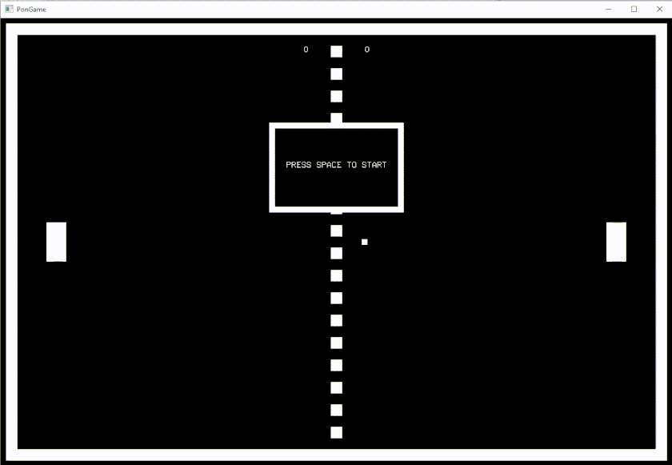

# pongame

## What is PonGame?
A sport / arcade game inspired by Allan Alcorn's classic Pong, which appeared in 1972. It is a simplistic graphics game simulating a tennis table.

PonGame puts into play a 1 vs 1 competition. Each of the players controls a vertical rocket in opposite sides of the table.

The goal is for one of the players to get the winning score before the other.

## Controls
<b>W / S</b> = UP / DOWN left player

<b>P / L</b> = UP / DOWN right player

<b>SPACE</b> = START / PAUSE GAME

<b>R</b> = RESET / REMATCH GAME

## Trailer

